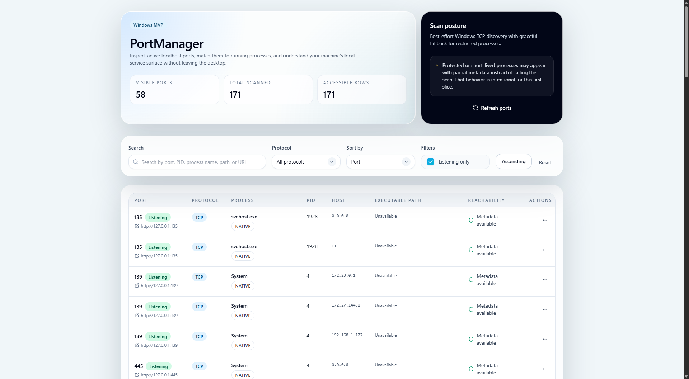
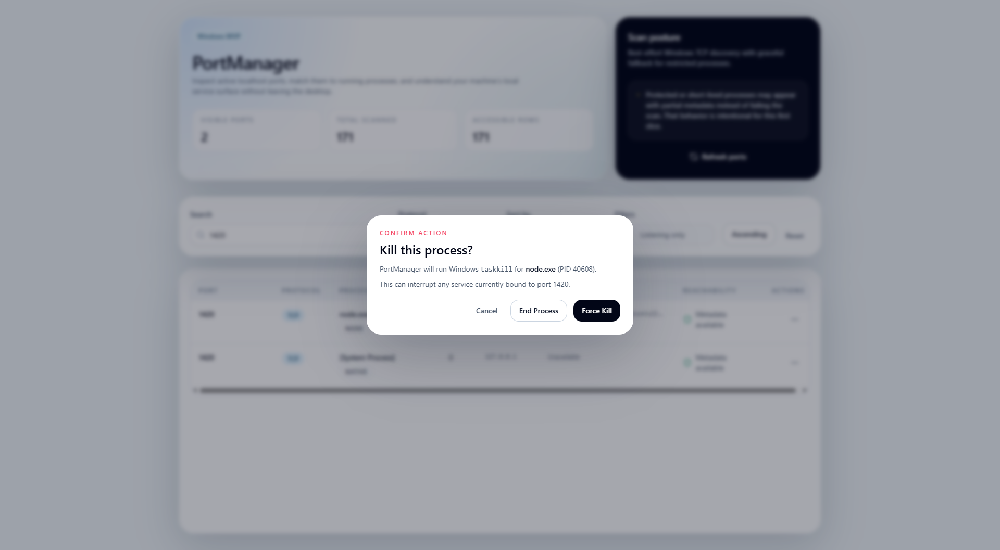

# PortManager

PortManager is a Windows-first desktop app for inspecting active localhost ports, matching them to running processes, and taking common local-service actions without bouncing between terminals, Task Manager, and browser tabs.

It is built with Tauri v2, Rust, React, and TypeScript, and is currently focused on a polished MVP for local development workflows on Windows.

## What it does

- Scans active local TCP ports
- Matches ports to running processes and PIDs
- Shows best-effort process metadata such as executable path
- Supports search, filtering, sorting, and manual refresh
- Lets you open the detected service in a browser
- Lets you open the process folder or a terminal in the process directory
- Supports `taskkill` with confirmation before terminating a process
- Runs as a desktop utility with a tray icon and tray menu

## Screenshots

### Main window



### Row actions menu


### Kill confirmation



## Installation

### Option 1: Run from source

PortManager is currently easiest to use by running it from source.

#### Requirements

- Windows 10 or Windows 11
- [Node.js](https://nodejs.org/) 20+ with `npm`
- [Rust](https://www.rust-lang.org/tools/install)
- Microsoft Visual Studio Build Tools with C++ support for Tauri/Rust builds
- WebView2 Runtime installed on Windows

#### Steps

1. Clone the repository:

```bash
git clone https://github.com/your-username/port-manager.git
cd port-manager
```

2. Install frontend dependencies:

```bash
npm install
```

3. Start the desktop app in development mode:

```bash
npm run tauri:dev
```

### Option 2: Build a local executable

If you want a local production build on your own machine:

```bash
npm install
npm run tauri:build
```

The built Windows executable will be created at:

```text
src-tauri/target/release/port-manager.exe
```

## Development

Useful commands:

```bash
npm run typecheck
npm run lint
npm run test:run
cargo test --manifest-path src-tauri/Cargo.toml
```

## Current status

PortManager is already runnable and manually testable, but it is still an in-progress MVP.

Current focus:

- Windows-first support
- Local desktop workflow
- Core port discovery and process actions

Still planned:

- settings screen
- startup options
- CLI support
- deeper WSL and Docker support
- broader release polish

## Notes

- Windows is the primary target right now.
- Process metadata is best-effort; some protected processes may expose only partial information.
- Some actions may require elevated permissions depending on the target process.
